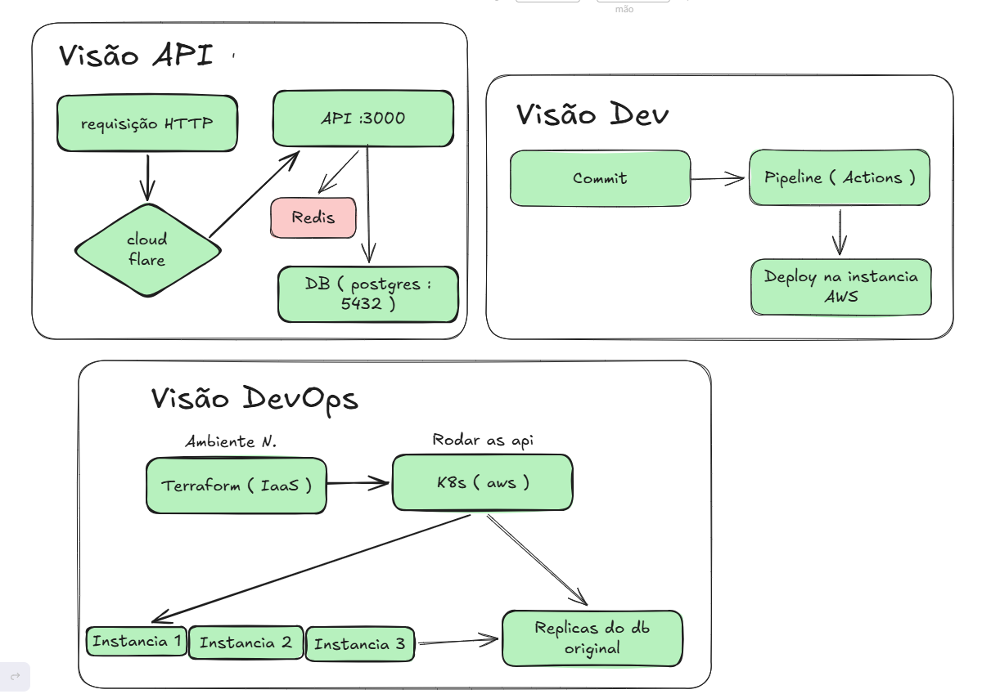

# 🚀 Flash Sales API - DevSecOps Architecture

API desenvolvida em **Node.js (TypeScript)** com foco em alta performance para eventos de *Flash Sales* (promoções relâmpago), utilizando uma arquitetura moderna baseada em **Docker**, **Kubernetes**, **Terraform** e **GitHub Actions**.

---

## 🛠️ Tecnologias Utilizadas
* **Backend:** Node.js, Express, TypeScript, TypeORM, ioredis, PostgreSQL.
* **Infraestrutura Local:** Docker & Docker Compose (Banco de dados e Cache).
* **Infraestrutura Cloud (IaC):** Terraform (AWS VPC, EKS Cluster, RDS PostgreSQL Master & Read Replica).
* **Orquestração:** Kubernetes (K8s).
* **CI/CD:** GitHub Actions.

---

## 📂 Estrutura do Projeto
.  
├── .github/ 
│   └── workflows/ 
│          └── ci-cd.yml          # Pipeline de automação do GitHub Actions 
├── terraform/ 
│   ├── main.tf                # Infraestrutura Cloud (VPC, Subnets, RDS Master/Replica)
│   ├── variables.tf           # Variáveis do Terraform
│   └── outputs.tf             # Saídas de dados da infraestrutura
├── k8s/                       # Manifestos do Kubernetes (Deployment, Service)
├── src/                       # Código-fonte da API Node.js
├── Dockerfile                 # Configuração do container da API
├── docker-compose.yml         # Ambiente local (PostgreSQL + Redis + API)
└── package.json

---

## ⚙️ Como Rodar o Ambiente Localmente

Para rodar a aplicação junto com o banco de dados e o Redis na sua máquina, utilize o **Docker Compose**.

### Pré-requisitos
* Docker e Docker Compose instalados.

### Passos:
1. Clone o repositório e acesse a pasta do projeto.
2. Suba os containers com o comando:
   docker compose up --build
3. O ambiente subirá automaticamente:
   * **API Node.js:** http://localhost:3000
   * **PostgreSQL:** localhost:5432
   * **Redis:** localhost:6379

Para derrubar os containers:
docker compose down

---

## ☁️ Comandos do Terraform (Infraestrutura em Nuvem)

Para provisionar a infraestrutura base na nuvem (AWS), navegue até a pasta `terraform/`:

1. **Inicializar o Terraform** (Baixa os plugins e dependências):
   terraform init
2. **Visualizar o plano de execução** (Preview de tudo o que será criado):
   terraform plan
3. **Aplicar a infraestrutura** (Cria de fato a VPC e os bancos Master/Réplica na AWS):
   terraform apply
4. **Destruir a infraestrutura** (Remove todos os recursos para evitar custos):
   terraform destroy

---

## ☸️ Como Escalar a Aplicação (Kubernetes)

Uma vez que o cluster Kubernetes esteja ativo (criado via Terraform), utilize os manifestos na pasta `k8s/` para replicar e gerenciar as instâncias da API:

1. **Aplicar os manifestos no Cluster:**
   kubectl apply -f k8s/
2. **Verificar as réplicas rodando:**
   kubectl get pods

---

## 🔄 Pipeline CI/CD (GitHub Actions)

A cada `git push` ou `Pull Request` enviado para a branch `main`, o GitHub Actions executa automaticamente:
1. Check-out do código.
2. Configuração do ambiente Node.js.
3. Instalação de dependências (`npm install`).
4. Execução de testes automatizados (`npm test`).

## System Design

# 1. CloudFlare
Bloquear requisições ou ataques problemáticos.

# 2. Pipeline
Evitar erros ao subir deploy ou atualizações da aplicação

# 3. Terraform
IaaS - Ajuda a ter um ambiente igual em todas as instancias

# 4. Kubernetes k8s
Replicar aplicação e permite ela segurar altas requisições.  
replicar bancos também